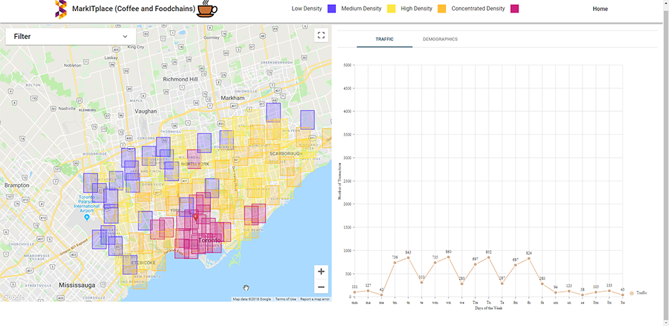

# Mark IT

<p align="center">
  
</p>

Mark IT is a web application that helps small business owners decide where and when to market their products. It takes advantage of the [TD Da-Vinci](https://td-davinci.com/) open banking API to show the volume of transactions in a particular region at a specific time. Using this data, small businesses can tune their marketing strategies to earn the most profit.

The application was built during the [Elevate Hackathon](https://elevatetechfest.com/elevate-hackathon/).

## Demo

Try it out [here](ec2-18-224-19-39.us-east-2.compute.amazonaws.com). Just click around and using the filter tab.

You can sign up for an account or use the following credentials.

**Username:** jn485057@gmail.com

**Password:** HelloWorld876123&

## Setup
```sh
git clone https://github.com/drdgvhbh/Mark-IT.git
cd Mark-IT
npm install
sudo npm install -g @aws-amplify/cli

amplify configure
```

1. Login to your AWS Account as a Root user
2. Press *Enter* in your terminal
3. Follow the Amplify CLI Prompts
4. Setup your IAM User Details
5. Paste the access key and secret key into your terminal
6. Setup a profile for this project

```sh
amplify init
```

Choose default options except for

* Distribution Directory Path -> dist

7. Choose the profile you created when it asks you to use a profile

```sh
amplify add auth (use default config)
amplify add hosting (use dev or prod according to your needs)
amplify publish
```

## Running
### Development
```sh
npm run dev
```

### Production
```sh
npm run build
npm run start
```
